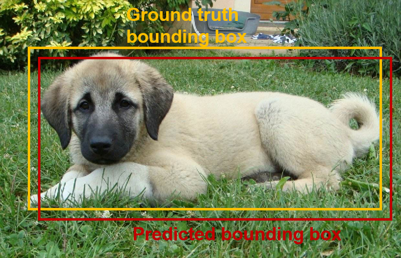
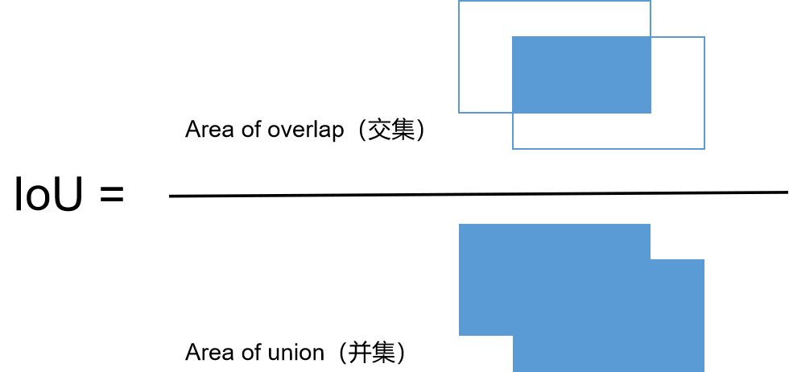
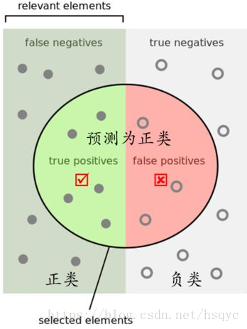
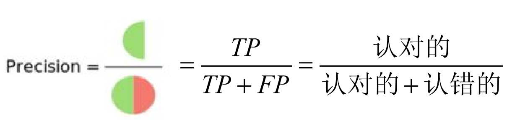
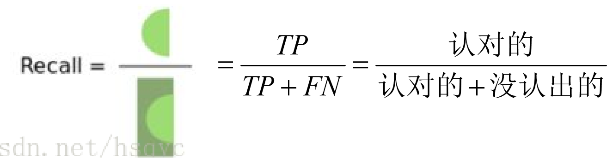
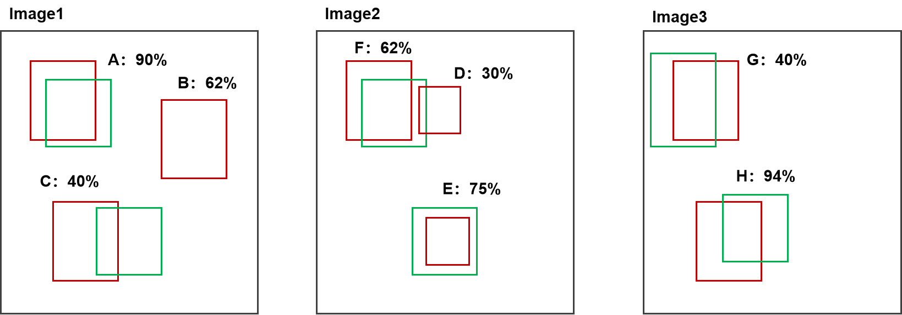
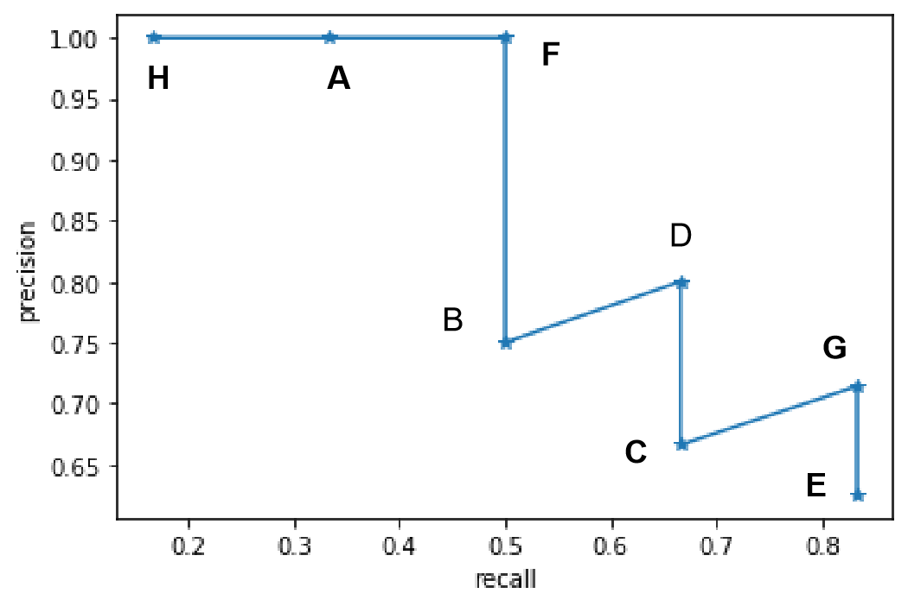
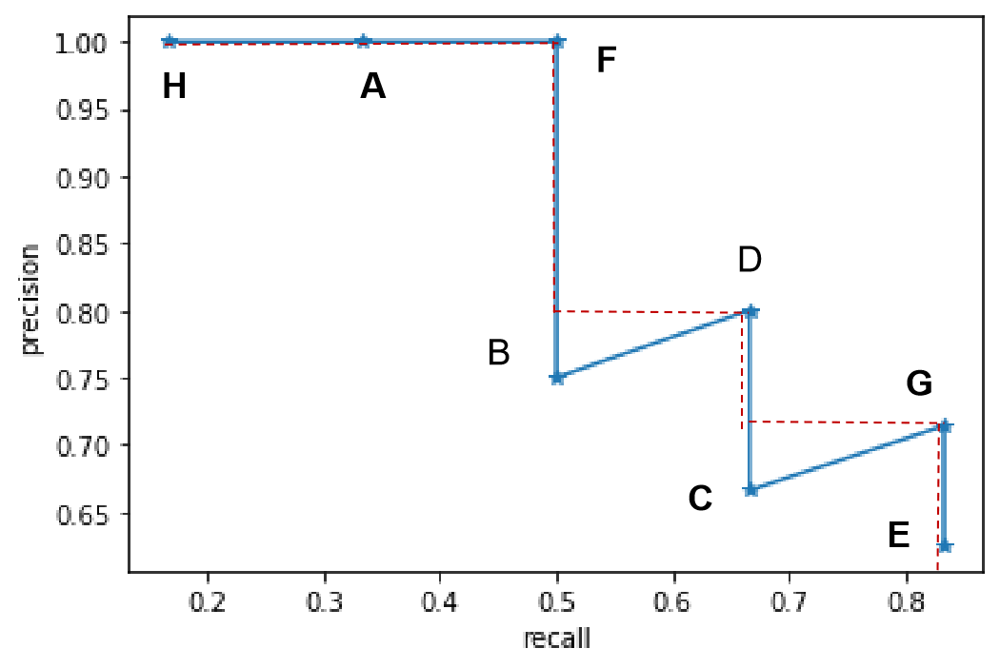

# Metrics

## IoU

IoU可以用来评估目标检测器的性能，例如下图中给定groud-truth bounding box和检测器的输出predicted bounding box，而IoU就是两个box的交集与并集的比值。





python编程实现

```python
def bb_intersection_over_union(boxA, boxB):
   # determine the (x, y)-coordinates of the intersection rectangle
   xA = max(boxA[0], boxB[0])
   yA = max(boxA[1], boxB[1])
   xB = min(boxA[2], boxB[2])
   yB = min(boxA[3], boxB[3])
   # compute the area of intersection rectangle
   interArea = max(0, xB - xA + 1) * max(0, yB - yA + 1)
   # compute the area of both the prediction and ground-truth
   # rectangles
   boxAArea = (boxA[2] - boxA[0] + 1) * (boxA[3] - boxA[1] + 1)
   boxBArea = (boxB[2] - boxB[0] + 1) * (boxB[3] - boxB[1] + 1)
   # compute the intersection over union by taking the intersection
   # area and dividing it by the sum of prediction + ground-truth
   # areas - the interesection area
   iou = interArea / float(boxAArea + boxBArea - interArea)
   # return the intersection over union value
   return iou

```

pytorch实现

```python
def bbox_iou(box1, box2):
    """
    Returns the IoU of two bounding boxes 
    """
    #Get the coordinates of bounding boxes
    b1_x1, b1_y1, b1_x2, b1_y2 = box1[:,0], box1[:,1], box1[:,2], box1[:,3]
    b2_x1, b2_y1, b2_x2, b2_y2 = box2[:,0], box2[:,1], box2[:,2], box2[:,3]
    #get the corrdinates of the intersection rectangle
    inter_rect_x1 =  torch.max(b1_x1, b2_x1)
    inter_rect_y1 =  torch.max(b1_y1, b2_y1)
    inter_rect_x2 =  torch.min(b1_x2, b2_x2)
    inter_rect_y2 =  torch.min(b1_y2, b2_y2)
    #Intersection area
    inter_area = torch.clamp(inter_rect_x2 - inter_rect_x1 + 1, min=0) * torch.clamp(inter_rect_y2 - inter_rect_y1 + 1, min=0)
    #Union Area
    b1_area = (b1_x2 - b1_x1 + 1)*(b1_y2 - b1_y1 + 1)
    b2_area = (b2_x2 - b2_x1 + 1)*(b2_y2 - b2_y1 + 1)
    
    iou = inter_area / (b1_area + b2_area - inter_area)
    
    return iou
```

## TP FP TN FN

对于二分类来说，Positive代表正样本/正类，Negative代表负样本/负类，True代表对样本分类正确，False代表对样本分类错误。对于分类的结果我们可以以下面图示作为参考：



上图矩形左半部分是positives，右半部分是negatives，圆圈内的表示预测为positive的类别，圆圈外的是预测为negative的类别。

- TP：样本被分类为正样本，且分类正确，也就是说被分类的本身是正样本；
- TF：样本被分类为负样本，且分类正确，也就是说被分类的本身是负样本；
- FP：样本被分类为负样本，但分类错误，也就是说被分类的本身是负样本；
- FN：样本被分类为负样本，但分类错误，也就是说被分类的本身是正样本；

对于多类别分类来说，也可以认为可以使用“多个二分类”的集合来表示，多类别中转化成二分类很简单：就是将一个类作为正样本，其余所有类别作为负样本。

## Precision

precision就是精确率的意思，即”分类器预测为正样本中确实为正样本所占的比例“，使用公式表示如下：



即衡量的是一个分类器分出来的正类的确是正类的概率。两种极端情况就是，如果精度是100%，就代表所有分类器分出来的正类确实都是正类。如果精度是0%，就代表分类器分出来的正类没一个是正类。

光是精度还不能衡量分类器的好坏程度，比如50个正样本和50个负样本，我的分类器把49个正样本和50个负样本都分为负样本，剩下一个正样本分为正样本，这样我的精度也是100%，但是傻子也知道这个分类器很垃圾。

**理解：**

1）precision是代表查准率，即衡量“认错人”的概率，precision越高代表越不容易认错人；

2）为了提高precision，可以设置较高置信度阈值，这样尽可能保证“认到的人”都能够保证“认对”，那么同时也可能导致将更多较低置信度的排除在外了，即造成很多人没有”认出来“，即recall下降。

## Recall

recall就是召回率的意思，即“所有正样本中被分类器确实预测为正样本所占的比例”，使用公式表示如下：



衡量的是一个分类能把所有的正类都找出来的能力。两种极端情况，如果召回率是100%，就代表所有的正类都被分类器分为正类。如果召回率是0%，就代表没一个正类被分为正类。

## AP

AP即**Average Precision**，平均精度的意思，AP是综合考虑precision与recall后的结果。

我们将通过一个简单的实例，进行AP计算。假设有三个图片需要进行识别检测，以下是分类器对一个类别的分类结果，绿色框代表真实框，红色框代表检测框。

其中对于待检测类别的检测框有8个，实际上真实类别框共有6个。



### 计算TP，FP

根据每个检测框对应的IOU，设置阈值(默认threshold=0.5)，分出TP，FP。即当IoU≥threshold时为TP，反之为FP，如果有一个检测框对应多个真实框的情况，选择最大IoU进行比较计算。例如对于上面三个图片的检测情况，每个检测框对应的结果为：

| image  | detection | confidence | TP or FP |
| ------ | --------- | ---------- | -------- |
| image1 | A         | 90%        | TP       |
| image1 | B         | 62%        | FP       |
| image1 | C         | 40%        | FP       |
| image2 | D         | 62%        | TP       |
| image2 | E         | 30%        | FP       |
| image2 | F         | 75%        | TP       |
| image3 | G         | 40%        | TP       |
| image3 | H         | 94%        | TP       |

### 计算Recall,Precision

由置信度从大到小排，并记录累计TP（AccTP）和累计FP（AccFP）。个人理解，原因是自信度越大是TP的概率就高。

Precision = AccTP / (AccTP+AccFP)，随着检测框数量增多，Precision有整体下降趋势。

Recall = AccTP / (AccTP+AccTN) = AccTP/所有真实框数量 = AccTP/6，由于Recall在真实框数量一定情况下仅仅与累计TP有关，故Recall只会增大，不会减小，作为横坐标正合适。这其实也就代表着，随着检测框数量的增多，Recall慢慢增大。

现在将每个检测框，按照置信度由大到小排列，得到结果如下表：

| image | detection | confidience | TP   | FP   | AccTP | AccFP | Precision | Recall |
| ----- | --------- | ----------- | ---- | ---- | ----- | ----- | --------- | ------ |
| 3     | H         | 94%         | 1    | 0    | 1     | 0     | 1         | 0.166  |
| 1     | A         | 90%         | 1    | 0    | 2     | 0     | 1         | 0.333  |
| 2     | F         | 75%         | 1    | 0    | 3     | 0     | 1         | 0.5    |
| 1     | B         | 62%         | 0    | 1    | 3     | 1     | 0.75      | 0.5    |
| 2     | D         | 62%         | 1    | 0    | 4     | 1     | 0.8       | 0.666  |
| 1     | C         | 40%         | 0    | 1    | 4     | 2     | 0.666     | 0.666  |
| 3     | G         | 40%         | 1    | 0    | 5     | 2     | 0.714     | 0.833  |
| 2     | E         | 30%         | 0    | 1    | 5     | 3     | 0.625     | 0.833  |


### 绘制曲线图

显然随着我们选定的样本越来也多，recall一定会越来越高，而precision整体上会呈下降趋势。把recall当成横坐标，precision当成纵坐标，即可得到常用的precision-recall曲线。



### AP计算

根据VOC2010以后的计算方法，我们绘制红色短划线，红色短划线是将锯齿状最高点与左边垂直线条连接而成，红色短划线与x=0和y=0轴而组成的面积就是AP。



即AP=1\*0.5 + 0.8\*(0.666-0.5) + 0.714/*(0.833-0.666) = 0.5 + 0.1328 + 0.119 = 0.752 = 75.2%

## Note:

- 如果置信度改变，那么对于AP的计算肯定会有些影响，AP的计算结果会不同。

## mAP

AP衡量的是对一个类检测好坏，mAP就是对多个类的检测好坏。就是简单粗暴的把所有类的AP值取平均就好了。比如有两类，类A的AP值是0.5，类B的AP值是0.2，那么mAP=（0.5+0.2）/2=0.35。

