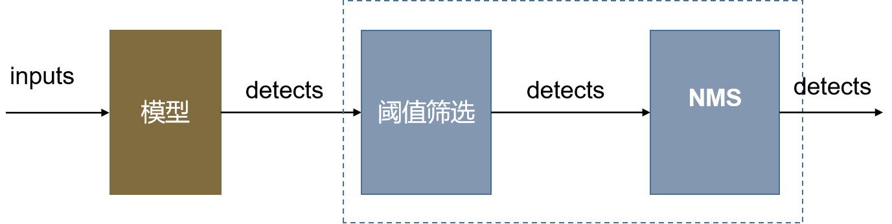
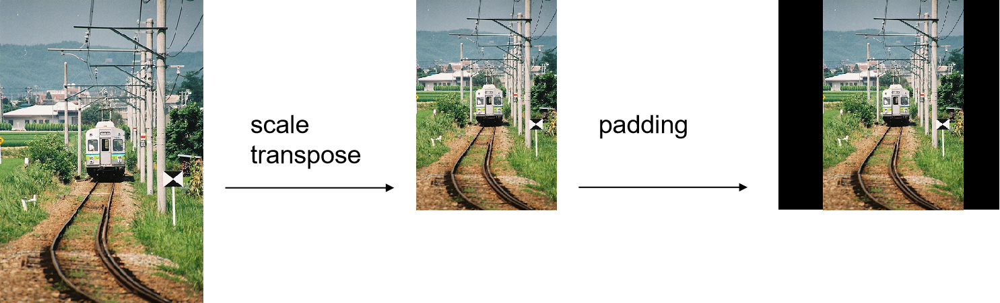
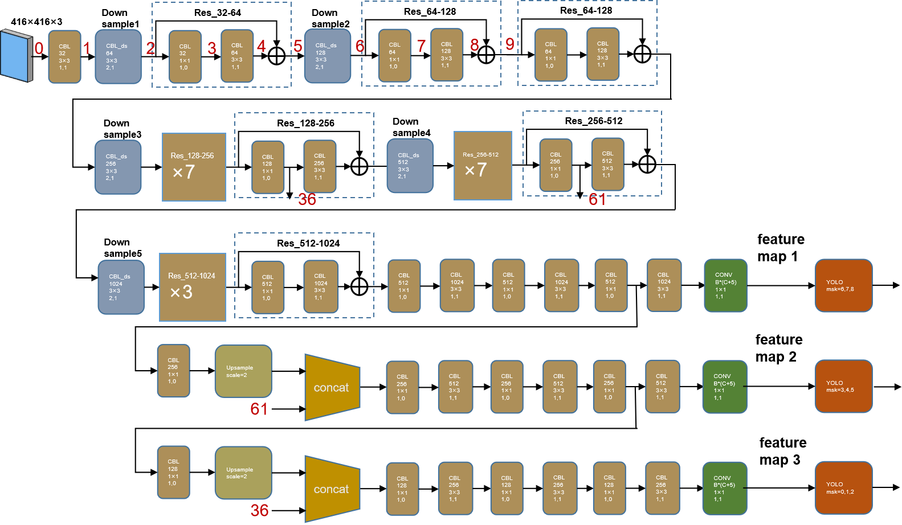
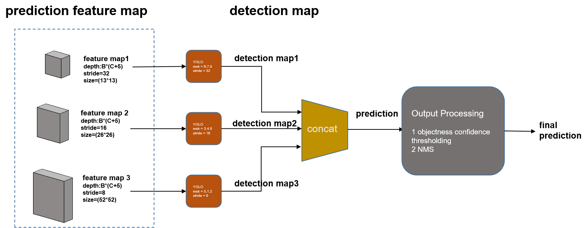
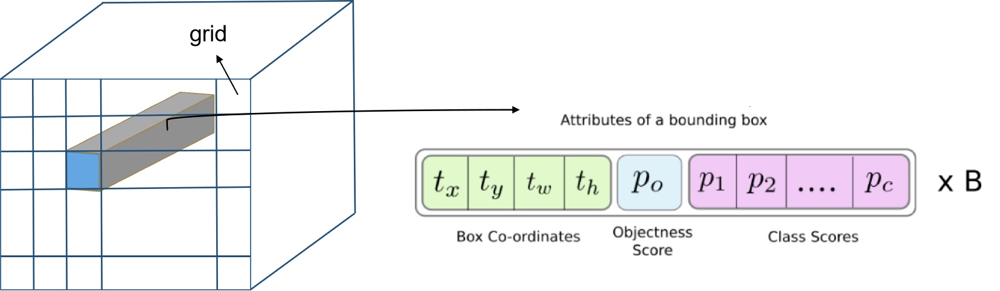
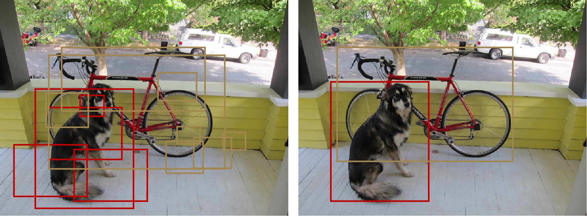

**Yolo algorithm note**

Author: 薛远奎(alex)

Date: 2019-12-20


# yolo简介

Yolo( You only look once )算法是一种强大高效、实时目标检测算法，历经演变，已经由最初的yolov1进化至目前yolov3。

# yolov3应用部署

本节我们将从项目应用与部署的角度，介绍yolov3，关于yolov3的算法与代码实现细节请参考下面章节——《yolov3详解》。

本章节内容基于开源项目(github:https://github.com/eriklindernoren/PyTorch-YOLOv3)为例，讲解yolov3的部署过程及该算法的相关概念。

## 项目文件结构

```python
yolov3
  |--/ assets
  |--/ config               # 存放网络模型结构定义文件
     |--+ yolov3.cfg
     |--+ yolov3-tiny.cfg
     |--+ coco.data        
     |--+ custom.data       # 用于定义训练数据路径、类别信息等
  |--/ data                 # 存放训练数据模板、类别定义(.names)、
     |--/ samples           # 存放一些用于测试识别的图片
     |--/ custom            # 训练文件夹格式模板
       |--/ images
       |--/ labels
       |--+ classes.names
       |--+ train.txt
       |--+ valid.txt
     |--+ coco.names
  |--/ output                # 用于保存测试输出结果
  |--/ utils                 # yolov3算法实现工具库
  |--/ weights               # 存放模型的weights
     |--+ yolov3.weights
     |--+ yolov3-tiny.weights
  |--+ models.py             # yolov3类定义
  |--+ train.py              # 用于模型训练，及在valid数据集做测试 
  |--+ test.py               # 基于训练后的模型参数，在test数据集做测试 
  |--+ detect.py             # 用于识别
```

## 训练(train)

### 制作数据集

对于深度学习的应用流程来说，第一步需要根据实际应用场景采集图片数据，制作数据集。我们使用的数据集制作工具是labelImg，其开源项目链接地址为： https://github.com/tzutalin/labelImg 。关于这个软件的更多功能使用可以自行百度，这里我们仅讲解通用功能。

**step1:配置label**

首先建立一个数据集文件夹命名为data_cetca，本文件夹用于保存制作的数据集的所有资料，并在data_cetca中添加以下内容：

- 文件夹images：用于保存图片文件，为了统一，图片文件应该以数字编号命名，例如001.png, 002.png, 003.png，为了说明图片的应用场景也可以添加前缀，例如xj_001.png, xj_002.png, xj_003.png等。
- 文件夹labels：用于保存annotation，每一个images中的图片文件都对应一个同名字的.txt文件，.txt文件中存放的就是该图片的annotation信息。由于一张图片可能有很多个目标，我们用一个方框(bounding box)将其框定，方框内的区域就代表该目标所包含的区域，训练过程中我们需要确定每个目标的类别、位置和大小，故.txt文件中的每一行的含义示例如下

| 类别(class) | center x | center y | w        | h        |
| ----------- | -------- | -------- | -------- | -------- |
| 1           | 0.679427 | 0.481019 | 0.025521 | 0.032407 |
| 0           | 0.633333 | 0.452315 | 0.019792 | 0.034259 |
| 2           | 0.598958 | 0.444444 | 0.031250 | 0.042593 |

特别注意的是(cx,cy)代表目标框中心点所在整个图片中的位置坐标，(w,h)是目标框的宽度和高度，这里的单位是归一化后的，如果图片尺寸是400\*300，w=0.02代表目标框宽度是0.02\*400=8像素，h=0.05代表目标框高度是0.05\*300=15像素。

- 文件classes.names：用于保存类别信息，根据实际应用将类别中的每个类分行写，例如格式如下

```
animal
people
car

```

- 文件train.txt：该文件中每一行代表一个训练集图片，每一行对应的图片必须在images文件夹中可以找到，可以是全部，可以是一部分。
- 文件valid.txt：该文件中每一行代表一个验证集图片，每一行对应的图片必须在images文件夹中可以找到。

**step2:打开软件**

我们可以通过anaconda prompt窗口输入如下命令打开软件：

```
(dp_pytorch11_GPU) D:\DeepLearning>cd labelImg-master
(dp_pytorch11_GPU) D:\DeepLearning\labelImg-master>python labelImg.py
```


软件打开后我们进行如下步骤：

- 首先点击**Open Dir**打开images文件夹
- 点击**Change Save Dir**打开labels文件夹
- 点击**Save**下的按钮，用于选择annotation格式，可以在PascalVOC和YOLO两种格式间切换，这里我们切换到YOLO格式。

**step3:添加目标框**

接下来我们就需要进行标注的工作了，即将图片中的所有目标一一框选备注类别信息。


首先点击Create RectBox（快捷键W），选中目标左上角按住左键拖至右下角，松开左键，新建bounding box，并且在弹出的类别选中框中选择类别；完成后可以在右侧栏看到一个目标生成信息；框选出所有的目标后，点击Save保存，那么你可以在labels文件夹中看到与图片同名的.txt文件生成！


### 修改yolov3配置文件

针对不同的识别应用，我们需要修改一下模型网络结构，打开config文件夹中的yolov3.cfg。文件中以中括号[]开始的部分就代表一个网络层。

- 修改classes参数：我们找到[yolo]层，根据识别应用中定义的目标类别数对classes修改，例如对于只有3个类别的数据集来说，那么classes=3。
- 修改filters参数：在每个[yolo]层前有一个[convolutional]层，我们根据公式filters=3*(classes+5)得到filters=24，这个参数代表的是该层输出tensor的channel值。
- 配置文件最开始是[net]层，这个不是实际的网络层，而是代表网络模型的一些参数，例如width,height代表模型识别的图片大小，必须是32的倍数！

### 开始训练

准备好数据集后，我们就可以开始训练模型了。打开train.py文件，我们需要首先进行一些代码更改：

**修改点1**

由于我们尽量避免使用不必要的工具包，该项目中使用了TensorFlow中的logger功能，这个相关代码我们注释掉，

```python
#from utils.logger import *
...
...
#logger = Logger("logs")
...
#logger.list_of_scalars_summary(tensorboard_log, batches_done)
...
#logger.list_of_scalars_summary(evaluation_metrics, epoch)
```

**修改点2**

main函数开始是命令行参数解析相关，关于各参数解释如下：

- epochs：训练集被重复训练的次数；
- batch_size：batch的大小，对于显存大的GPU，batch可以适当大一些，否则小一些。对于越复杂的模型，batch要小一些，例如yolov3结构的模型，batch=4，yolov-tiny结构的模型，batch=8；
- model_def：模型结构文件的路径，在文件夹config中，.cfg文件；
- data_config：训练集相关信息，，在文件夹config中，.data文件；
- pretrained_weights：经过一些数据集进行预训练过的模型参数；
- img_size：模型输入的图片大小，必须是32的倍数；


## 检测(detect)

这个过程是根据模型的输出结果，获取目标所在的位置和类别。



### outputs

yolov3的输出存放变量名为detects的tensor中，其size=(batch,10647,5+classes)，每个维度代表的具体含义请阅读<<yolov3详解>>相关章节内容。也就是说如果检测一张图片即batch=1，应用场景中的类别数量为3，那么模型的输出共有1\*10647\*8=85176个bounding box。

每个bounding box的属性信息(5+classes个)为：center_x, center_y, width, height,  p0, p1,... pc，其中p0是objectness_score，表示该bounding box包含目标的概率值，p1,..pc分别表示包含的目标所属每个类别的概率。

### 阈值筛选

模型的输出包含非常多待选的bounding box，那么如何从中进行剔除、帅选呢？

我们可以通过设置阈值(conf_thres)去掉那些很小概率包含目标的bounding box，即令p0<conf_thres对应的bounding box去掉。

### NMS

即使经过阈值筛选后，仍然存在很多bounding box，并且存在多个bounding box包含的目标是同一个，那如何进一步处理呢？

我们使用非极大值抑制（Non-maximum Suppression）用于去除冗余的bounding box，具体的算法流程请参考后续相关章节。

最后输出的是一个list，包含的成员是tensor，tensor的size=(object_numbers, 7)，第二个维度表示的信息为：(x1, y1, x2, y2, object_conf, class_score, class_pred)。

- (x1,y1) 代表bounding box左上角坐标
- (x2,y2) 代表bounding box右下角坐标
- object_conf 代表包含目标的概率
- class_score 代表类别得分
- class_pred 代表bounding box包含的目标类别

结果示例如下（batch=1）：

```
[tensor([[ 70.4133, 172.3040, 170.3421, 335.0493,   0.9995,   0.9933,  16.0000],
        [ 77.9969, 113.9357, 308.2616, 294.3891,   0.9927,   0.9998,   1.0000],
        [253.8938,  97.2812, 373.3151, 144.5639,   0.9970,   0.9423,   7.0000]])]
```


# yolov3详解

本章节内容基于开源项目(github:https://github.com/eriklindernoren/PyTorch-YOLOv3)详细分析了Yolo-v3的算法框架，为了对算法有更深入的了解，需要参考项目代码进行本文档的阅读。

## 名词解释

| 名词          | 解释                                                         |
| ------------- | ------------------------------------------------------------ |
|               |                                                              |
| yolo层        | yolo算法特有的网络层，有三个yolo层，可处理三个尺度的输入tensor |
| feature map   | yolo网络层的输入tensor                                       |
| predicton map | yolo层的输出tensor，与feature map同尺度                      |
|               |                                                              |

## input

yolov3的输入图像宽和高是相等的，而且宽和高必须是32的倍数。在实际应用中，待识别的图片宽和高不满足该要求，那么我们需要对图片进行尺度变换(scale)和添加空白边框(padding)，以便满足要求。

例如下图，左边是一个随机大小的图片，经过尺度缩放，再添加空白边框，就可以得到满足输入要求的图片（假设输入大小定为416*416了。



在进行scale transpose的时候，一般按照长边计算缩放系数(if: img_h>img_w，then: scale_factor = img_h/416)，将图片的宽和高按照该尺度进行缩放(img_h /= scale_factor, img_w /= scale_factor)；然后再将短边进行padding，获取宽高都为416的输入。

## 预测过程

预测过程即yolo模型预先加载模型参数后，处理输入的图片获取图片中的目标位置及类别的过程。该过程不涉及目标函数的计算和网络参数的优化，较为简单，能够对整个模型的工作原理有更直观的理解。

### configure frame

为了理解方便，我们将整个网络结构分两个部分表示，第一部分主要展示网络层构架，第二部分主要描述模型输出结果的处理流程。

#### 网络层构架

yolov3.cfg文件定义了整个神经网络的架构，如下图所示




1. 模型中的CBL网络层是由Conv、BatchNorm、LeakyReLU三层进行组合得到，参数依次为输出channels（例128）、kernel size（例3*3）、stride和padding（例2,1）。
2. yolov3.cfg中定义的conv2d层中的pad=1意思是进行padding（pad=True），但要pad的大小是经过了计算得到即：pad=(kernel size - 1)//2。

**shortcut**：

类似于ResNet中的结构，用于将两个tensor进行相加。

**route**：

用于将一个或多个tensor进行拼接(concatenate)。

**yolo**：

yolo算法的特殊层，主要用于feature map到detection map的转换处理。

#### 输出处理流程

特别注意，下面的框图中的很多数字是基于输入图片的大小为416*416，其实yolov3的输入图片大小可以是任意32的倍数即可，如果输入图片的大小改变，那么有些数字可能需要更改，例如feature map中的size参数。



### Feature map

经过最后一个卷积层(kernelsize=1\*1，channels=B\*(C+5)) )的处理后，得到了feature map tensor。feature map size为：(batch,  B*(c+5),  grid_num,  grid_num)，其中官方给的B=3，即anchor的数量，c代表class number即类别数，grid_num是img_size/stride，官方的img_size=416，3个yolo层的stride分别为32,16,8。根据3个yolo层对应的stride，可以得到：

- yolo1的feature map size是(batch,  3*(c+5), 13, 13)
- yolo2的feature map size是(batch,  3*(c+5), 26, 26)
- yolo3的feature map size是(batch,  3*(c+5), 52, 52)

请注意，pytorch中的tensor第一个维度表示batch，第二个维度表示channel，第三个和第四个表示宽、高。但是为了直观的表示出feature map，还是将其表示为一个立方体（输入batch=1，即一个样本的feature map），如下图：



feature map的每一个**方格(grid)**中存放了3个**bounding box**，每一个bounding box都给出基于一个anchor为参考时，目标出现的概率、位置、大小及所属的类别信息。

在实际图片训练过程中，feature map的size为(batch_size,  anchor_num*(class_num+5),  grid_num,  grid_num)。也就是对应yolo1层来说，方格(grid)数量为grid_num = img_size/stride1 = 416/32=13。

**Box coordinates**：

B：表示每个单元格（cell/grid）所预测出的bounding box的数量，yolov3中，B=3。

$t_x, t_y $：用于后续计算bounding box的中心点坐标

$t_w, t_h$：用于后续计算bounding box的宽和高

objectness score：表示bounding box中包含一个目标的概率

class scores：表示bounding box包含的目标属于各类别对应的得分

### Detection map

这一步是根据feature map进行进一步的运算操作，预测出目标的box位置、尺度和类别，这步操作是由yolo算法中的yolo layer（代码中为YOLOLayer）来完成。

**类别预测**：

1. 对feature map中objectness score进行sigmoid操作。
2. 对feature map中class scores进行sigmoid操作，用于进行类别预测。

**位置和尺度预测**：

位置和尺度的运算是根据如下公式进行：
$$
\begin{equation}
b_x = \sigma(t_x) + c_x \\
b_y = \sigma(t_y) + c_y \\
b_w = p_w e^{t_w} \\
b_h = p_h e^{t_h} \label{equ_1} 
\end{equation}
$$
注意这里的坐标系x,y方向与opencv中定义的图像坐标系方向一致，左上角为原点，往右是x正方向，往下是y正方向。

该公式对应的图示如下：


$c_x,c_y$：是prediction map相应单元格的左上角坐标，对于prediction map1（输入的图片大小为416，stride = 32）来说一共有13*13个单元格，每个单元格的左上角坐标依次为(0,0), (0,1), ....., (1,0), (1,1), ....., (12,12)。

$b_x,b_y$：预测的bounding box中心的坐标，例如(6.4, 6.7)，单位是1（代表的是1个单元格）。

$p_w,p_h$：是anchors的宽和高，yolov3.cfg文件中的anchors的单位是像素，实际计算时需要预先将anchor进行对应的stride缩放，例如feature map1要进行anchor /= 32运算，这样得到的anchor的单位是1（代表的是1个单元格）。

$b_w,b_h$：是预测的bounding box的宽和高，单位是1（代表的是1个单元格）

sigmoid函数的作用：将$t_x,t_y$归到(0,1)范围之内，这样$b_x,b_y$就不会跑出该单元格之外。

注意，前面的所有变量的单位都是1（代表的是1个单元格），我们需要将其转到像素单位上。所以最后我们需要根据feature map的stride进行单位转换：
$$
b_x = b_x * stride \\
b_y = b_y * stride \\
b_w = b_w * stride \\
b_h = b_h * stride
$$


## Output Processing

这里进一步来处理Detection map，最终得到目标的类别、位置！

对于416*416大小的图片来说，Yolov3的三个yolo层输出的grid_num分别为13，26，52，会预测出$[(13 \times 13) + (26 \times 26) + (52 \times 52)]\times 3=10647$个bounding box，那如何从这么多个中选择合适的？

1、**Thresholding by Object Confidence** 

对object confidence进行阈值检测，每个bounding box都有objectness score，通过与设置的阈值进行比较，如果objectness score比阈值小，则将该bounding box的所有属性都置为0。

2、 **Non-maximum Suppression** 

非极大值抑制在目标识别中的作用是去除冗余的bounding box，保留最好的一个，NMS intends to cure the problem of multiple detections of the same image。

输出的检测结果shape为 (batch_size, object_number, 7)，最后一个维度对应的格式为：(x1, y1, x2, y2, object_conf, class_score, class_pred)。


## 训练过程

训练过程就是根据目标函数进行最优化，不断调整网络模型参数的过程。

### label

训练模型之前需要根据图片中所有目标的位置制作标签，使用labelImg制作的yolo标签样例如下：

```
1 0.773177 0.534259 0.024479 0.033333
1 0.727865 0.506944 0.022396 0.039815
1 0.681250 0.498148 0.010417 0.053704
```

行数代表图片中框选出的目标数量，其中每一行代表一个目标的类别、中心点x、中心点y、宽度w、高度h，其中x,y,w,h是根据图片宽和高经过归一化处理，如果用像素来表示那么目标中心点为x\*img_w，目标的像素宽度是w\*img_w！

**注意**：如果图片的大小不满足输入的要求，那么在预处理时，改变了图片的长宽，对应的也要将x,y,w,h进行相应的处理。

### targets

在训练过程中，batch_size代表的是图片数量，每张图片可能有多个目标，也就是label会有多行，假如batch_size=2，第一个图片有一个目标，第二个图片有三个目标，这个batch共有4个目标，那么targets可以表示为：

```
[[0.0000, 0.5100, 0.5000, 0.1454, 0.1829],
 [0.0000, 0.7122, 0.6250, 0.2630, 0.4297],
 [1.0000, 0.5540, 0.4870, 0.5951, 0.3932],
 [2.0000, 0.2454, 0.2780, 0.2982, 0.1471]]
```

现在将所有目标的label信息叠放到一个二维tensor中，不好区分目标所在的图片序号了，那就增加一列，存放目标label所属的图片序号：

```
[[0.0000, 0.0000, 0.5100, 0.5000, 0.1454, 0.1829],
 [1.0000, 0.0000, 0.7122, 0.6250, 0.2630, 0.4297],
 [1.0000, 1.0000, 0.5540, 0.4870, 0.5951, 0.3932],
 [1.0000, 2.0000, 0.2454, 0.2780, 0.2982, 0.1471]]
```

由于label中的x,y,w,h是根据图片img_size进行了归一化，那么为了与detection map的单位进行统一，则：
$$
x = x*stride\\
y = y*stride\\
w = w*stride\\
h = h*stride
$$

根据label获得targets后，使用如下公式对targets进行单位转换：

```
targets = targets[2:6] * scale
```

### prediction

为了更方便loss的计算，我们需要对detection map进行维度转换得到prediction tensor。

令一个yolo层输出的detection map tensor为变量x，则：

```python
prediction = (x.view(num_samples,num_anchors,num_classes+5,                                                grid_num,grid_num).permute(0, 1, 3, 4, 2).contiguous()
             )
```

那么得到的prediction的shape为：

prediction.size=(batch_size,  anchor_num, grid_num,  grid_num, class_num+5))

prediction的最后一个维度表示的信息为：(bx, by, bw, bh, p, pc_0, pc_1, ...)​，其中​p​表示目标置信度，​pc_i​ 表示目标属于类别=i​ 的概率。

这个tensor非常重要，后续的loss计算需要用到它。

### 索引计算

#### 获取batch index索引

由于一个batch处理的图片可能不止一个，我们需要知道targets中的每一个目标对应于prediction中的第几个样本！根据targets的第1列可以很容易得到。

```
b = targets[:, 0].long()
```

#### 获取最优的anchor索引

根据targets的width和height与每个scaled anchor（配置文件中的anchor根据yolo层的stride进行缩放）进行IOU计算，即计算两个box的交集与并集的比值。得到结果对应的tensor size=(num_anchor, num_targets)，每一行代表一个anchor与所有target的IoU计算结果。

例如对于一个batch，有2个样本，4个目标(objects_number=4)，targets与yolo1的anchor进行IoU计算得到了ious：

```
ious = [[0.0026, 0.0111, 0.0230, 0.0043],
        [0.0009, 0.1037, 0.0078, 0.0015],
        [0.0202, 0.0010, 0.0020, 0.0004]]
_,best_n = ious.max(0)
```

那么沿着行进行比较获取每一列中最大值所在的行为：best_n = [2,1,0,0]，这个结果意味着四个目标对应yolo1最优anchor分别是第3个，第2个，第1个，第1个。

#### 获取目标的位置索引

targets的第3列和第4列表示的是目标中心点的位置，将这两列转换成正整数，即：

```python
targets = targets[2:6] * scale #尺度转换
gxy = targets[2:4].long().t()
gi = gxy[0] #gi中的成员表示目标所在的列
gj = gxy[1] #gj中的成员表示目标所在的行
```

#### 获取类别索引

targets的第2列表示的是每个目标所属于的类别

```
target_labels = targets[:,1].long()
```

### 计算tx,ty,tw,th

在预测过程中，我们需要根据模型的feature map由公式$\eqref{equ_1}$计算detection map，而在训练过程中，我们需要根据targets计算出feature map对应的ground truth，这时的计算过程正好是公式的逆过程。故：
$$
\begin{equation}
t_x = b_x - c_x \\
t_y = by - c_y \\
t_w = log(b_w/p_w) \\
t_h = log(b_h/p_h)\label{equ_2} 
\end{equation}
$$
**tx,ty**:

tx,ty表示的是目标中心点与所在的bounding box左上角的偏移量，计算如下：

```
targets = targets[2:6] * scale
tx = torch.FloatTensor(nB, nA, nG, nG).fill_(0)
ty = torch.FloatTensor(nB, nA, nG, nG).fill_(0)
gx = targets[:,2]
gy = targets[:,3]
tx[b, best_n, gj, gi] = gx - gx.floor()
ty[b, best_n, gj, gi] = gy - gy.floor()
```

**tw,th**:

tw,th表示的是目标宽和高的尺度

```
targets = targets[2:6] * scale
tw = torch.FloatTensor(nB, nA, nG, nG).fill_(0)
th = torch.FloatTensor(nB, nA, nG, nG).fill_(0)
gw = targets[:,4]
gh = targets[:,5]
tw[b, best_n, gj, gi] = 
          torch.log(gw / anchors[best_n][:, 0] + 1e-16)
th[b, best_n, gj, gi] = 
          torch.log(gh / anchors[best_n][:, 1] + 1e-16)
```


### 计算loss

yolo-v3模型一共三个yolo层，我们以一个yolo层loss计算为例，讲解loss的计算过程。模型的total loss应该是三个yolo层的loss之和。

#### loss_conf_obj

这里我们计算有目标置信度的loss，首先我们计算obj_mask，其size与prediction map一模一样。obj_mask某一位置为1，表示prediction map的对应位置的bounding box是包含目标，首先初始化obj_mask:

```python
obj_mask = ByteTensor(batch_size,num_anchors,grid_num,grid_num).fill_(0)
```

那么我们就可以基于前面得到的一系列索引，将有目标的位置置为1了：

```python
obj_mask[b, best_n, gj, gi] = 1
```

有趣的是，obj_mask也可以表示真实的置信度，obj_mask为1的位置表示该位置对应的bounding box包含目标，即置信度为1.0；反之，不包含目标，即置信度为0.0。故我们置信度的ground truth为tconf可以获取：

```python
tconf = obj_mask.float()
```

现在根据prediction，我们可以获取预测的目标是否存在的置信度了：

```
pred_conf = torch.sigmoid(prediction[..., 4])
```

loss_conf_obj就可以使用binary cross entropy计算，如下：

```python
loss_conf_obj = bce_loss(pred_conf[obj_mask], 
                         tconf[obj_mask])
```

#### loss_conf_noobj

这里我们计算有目标置信度的loss，首先我们计算noobj_mask，其size与prediction map一模一样。noobj_mask某一位置为1，表示prediction map的对应位置的bounding box是不包含目标，首先初始化noobj_mask:

```python
noobj_mask = ByteTensor(batch_size,num_anchors,grid_num,grid_num).fill_(1)
```

那么我们就可以基于前面得到的一系列索引，将有目标的位置置为1了：

```python
noobj_mask[b, best_n, gj, gi] = 0
# Set noobj mask to zero where iou exceeds ignore threshold
for i, anchor_ious in enumerate(ious.t()):
    noobj_mask[b[i], anchor_ious>ignore_thres, gj[i], gi[i]] = 0
```

loss_conf_noobj就可以使用binary cross entropy计算，如下：

```
loss_conf_noobj = bce_loss(pred_conf[noobj_mask], 
                           tconf[noobj_mask])
```

#### loss_x,loss_y,loss_w,loss_h

首先获取prediction的x,y,w,h

```
x = torch.sigmoid(prediction[..., 0])        
y = torch.sigmoid(prediction[..., 1])        
w = prediction[..., 2]                   
h = prediction[..., 3]
```

使用MSE计算loss

```
loss_x = self.mse_loss(x[obj_mask], tx[obj_mask])
loss_y = self.mse_loss(y[obj_mask], ty[obj_mask])
loss_w = self.mse_loss(w[obj_mask], tw[obj_mask])
loss_h = self.mse_loss(h[obj_mask], th[obj_mask])
```

#### loss_cls

首先根据targets获取one-hot编码格式的class：

```
tcls = FloatTensor(nB, nA, nG, nG, nC).fill_(0)
target_label = target[:,1].long()
tcls[b, best_n, gj, gi, target_labels] = 1
```

然后计算**class_mask**，即类别预测正确位置置1：

```python
class_mask = FloatTensor(nB, nA, nG, nG).fill_(0)
pred_cls = torch.sigmoid(prediction[..., 5:])

#pred_class.size = (objects_number)
#objects_number表示batch中所有样本包含的目标总数
pred_class = pred_cls[b, best_n, gj, gi].argmax(-1) 
#出现目标的grids中能够正确预测类别的grid所在位置置为1
correct_mask = (pred_class == target_labels)
class_mask[b, best_n, gj, gi] = correct_mask.float()
                
```

计算loss

```
loss_cls = self.bce_loss(pred_cls[obj_mask], tcls[obj_mask])
```

#### loss

```
loss = loss_conf_obj + loss_conf_noobj +
       loss_x + loss_y + loss_w + loss_h +
       loss_cls
```

### 计算iou_scores

预测bounding box是存放在detection map，真实目标的bounding box为targets中x,y,w,h四列。

首先初始化iou_scores:

```python
#每一个grid的iou score初始化为0
iou_scores = FloatTensor(nB, nA, nG, nG).fill_(0)
```

然后根据targets，将选定的所有grid的iou score计算出来：

```python
#selected_boxes.size() = target_boxes.size() = (objects_number,4)
selected_boxes = pred_boxes[b, best_n, gj, gi]
#将selected box与target_box一个一个的比较，比较一对得到一个iou_score
#故iou_scores.size() = (objects_number)
iou_scores[b, best_n, gj, gi] = bbox_iou(selected_boxes, 												 target_boxes)
```

### 模型能力衡量指标-Metrics

Metrics英文含义是指标、衡量，这里用来表示可以量化模型能力的一批参数，主要包括：

#### 准确率

```
cls_acc = 100 * class_mask[obj_mask].mean()
```

#### precision

```python
#根据预测，将预测概率大于50%的grid标记出来
pred_conf = torch.sigmoid(prediction[..., 4])
conf50 = (pred_conf > 0.5).float()
iou50 = (iou_scores > 0.5).float()
iou75 = (iou_scores > 0.75).float()
#在正确识别的grid中，根据置信度进一步筛选
detected_mask = class_mask * conf50 * tconf

precision = torch.sum(iou50 * detected_mask) / 
                     (conf50.sum() + 1e-16)
```

其中：pred_conf, conf50, iou_scores, iou50, detected_mask的size都为(batch_size, anchor_num, grid_num, grid_num)

#### recall

```python
recall50 = torch.sum(iou50 * detected_mask) / 
                    (obj_mask.sum() + 1e-16)
recall75 = torch.sum(iou75 * detected_mask) / 
                    (obj_mask.sum() + 1e-16)
```


## NMS

非极大值抑制（Non-maximum Suppression）用于去除冗余的bounding box，假设有6个bounding box，放在集合B中，即B={a,b,c,d,e,f}，按照其objectness confidence由小到大排序为a,b,c,d,e,f。

算法流程如下：

1）设定阈值0.4，一般范围是0.3-0.5

2）将最大confidence对应的box f拿出，并放入到集合D中（D={f}），将B中的box(a,b,c,d,e)依次与之比较，重叠度IoU大于设定阈值的box去掉，假如去掉后B={a,c,e}。

3）从集合B中再选取最大confidence对应的boxe，并放入集合D中（D={f,e}），再将B中的box(a,c)与e比较，去掉IoU大于设定阈值对应的box。

4）重复以上过程，集合D中的box就是最后的结果。



# 处理速度记录

| 序号 | 平台                                                         | detect fps(yolov3) | detect fps(yolov3-tiny) |
| ---- | ------------------------------------------------------------ | ------------------ | ----------------------- |
| 1    | CPU:Xeon E-2176M<br />GPU：Quadro P4200<br />内存：16G<br />系统：win10-64bit<br /> | 12                 | 18                      |
| 2    | CPU: i7-8565U<br />GPU：GTX 1050<br />内存：16G<br />系统：win10-64bit<br /> | 10                 | 26                      |
|      |                                                              |                    |                         |

